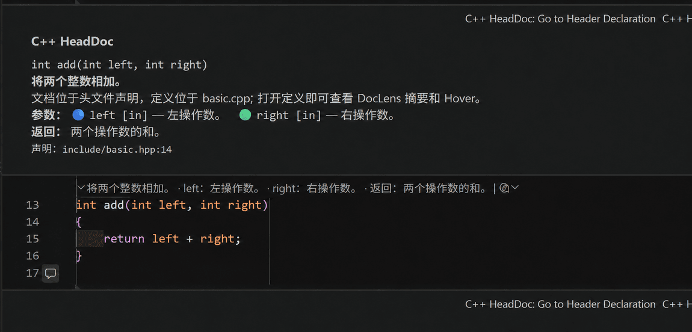

# C++ HeadDoc

[English](README.en.md) | 简体中文

C++ HeadDoc 把头文件声明上方的 Doxygen 文档显示在 `.cpp` / `.c` 实现旁。初始状态保持紧凑，点击 CodeLens 后显示可自动换行的完整文档，并支持三档相对字号；Hover、声明跳转和可选 Markdown 预览可用于快速浏览与深入阅读。

当前版本：`0.2.1`

## 界面效果



扩展使用 VS Code 原生内联评论组件呈现文档，因此会跟随当前颜色主题，并在编辑器宽度变化时自动换行。截图展示点击函数上方 CodeLens 后的展开效果。

## 主要功能

- 在函数、方法、构造函数和运算符实现旁显示只读内联文档。
- 初始显示紧凑摘要，点击后展开完整注释；支持 `small`、`medium`、`large` 三档字号，并用稳定的彩色标记区分参数。
- 悬停函数名查看文档，点击 CodeLens 展开或折叠。
- 从内联文档直接跳转到头文件声明，也可按需打开 Markdown 预览。
- 解析 `/** ... */`、`/*! ... */`、`///` 和 `//!`，支持 `brief`、`param`、`tparam`、`return`、`retval`、`note`、`warning`、`throws`、`deprecated`、`see` 等常用标签。
- 通过 VS Code 的文档符号和声明能力连接 clangd 或 Microsoft C/C++，适配本地、Remote SSH、WSL 和 Dev Containers。

## 环境要求

- VS Code `1.134.0` 或更高版本。
- clangd 或 Microsoft C/C++ 扩展，并能正常执行“转到声明”。
- 从源码开发和打包时使用 Node.js `24.11.1`。

C++ HeadDoc 使用语言服务定位声明；编译器选项、宏和包含目录仍由语言服务及 `compile_commands.json` 管理。

## 安装

从 [GitHub Releases](https://github.com/timzou/cpp-headdoc/releases/latest) 下载 VSIX，然后执行：

```powershell
code --install-extension cpp-headdoc-0.2.1.vsix
```

也可以在 VS Code 扩展视图右上角菜单中选择“从 VSIX 安装…”。

从源码打包：

```powershell
npm ci
npm run package
code --install-extension release/cpp-headdoc-0.2.1.vsix
```

## 快速开始

1. 安装并配置 clangd 或 Microsoft C/C++。
2. 打开包含头文件和实现文件的工作区。
3. 在头文件声明上方编写 Doxygen 注释。
4. 打开对应 `.cpp` / `.c` 实现，函数上方会显示紧凑摘要和展开入口。
5. 使用 CodeLens 展开或折叠；在文档工具栏中可跳转到声明或打开 Markdown 预览。

示例工程位于 `examples/basic-cmake/`。

## 配置

所有设置使用 `cppHeadDoc.*` 前缀。

| 设置 | 默认值 | 说明 |
| --- | --- | --- |
| `cppHeadDoc.enabled` | `true` | 启用当前工作区功能。 |
| `cppHeadDoc.showInlineComments` | `true` | 在实现旁显示可换行的内联文档。 |
| `cppHeadDoc.inlineCommentsExpanded` | `false` | 设为 `true` 时，内联文档首次出现即自动展开。 |
| `cppHeadDoc.inlineCommentTextSize` | `medium` | 相对字号：`small`、`medium` 或 `large`。 |
| `cppHeadDoc.showCodeLens` | `true` | 显示折叠/展开控制与紧凑摘要。 |
| `cppHeadDoc.showHover` | `true` | 悬停函数名时显示完整文档。 |
| `cppHeadDoc.summaryStyle` | `briefAndTags` | `brief`、`briefAndParams` 或 `briefAndTags`。 |
| `cppHeadDoc.maxSummaryLength` | `180` | CodeLens 摘要长度，范围 `40`–`500`。 |
| `cppHeadDoc.showParametersInCodeLens` | `true` | 在摘要中包含参数。 |
| `cppHeadDoc.showReturnValueInCodeLens` | `true` | 在摘要中包含返回值。 |
| `cppHeadDoc.headerExtensions` | `.h`, `.hpp`, `.hh`, `.hxx` | 头文件扩展名。 |
| `cppHeadDoc.sourceExtensions` | `.c`, `.cc`, `.cpp`, `.cxx` | 实现文件扩展名。 |
| `cppHeadDoc.maxCommentSearchLines` | `40` | 声明上方向上查找注释的最大行数，范围 `5`–`500`。 |
| `cppHeadDoc.debounceMs` | `300` | 文件变化后的刷新延迟，范围 `50`–`5000` 毫秒。 |
| `cppHeadDoc.maxCacheEntries` | `500` | 内存缓存条目上限，范围 `20`–`5000`。 |
| `cppHeadDoc.logLevel` | `error` | `off`、`error`、`info` 或 `debug`。 |

示例：

```json
{
  "editor.codeLens": true,
  "cppHeadDoc.enabled": true,
  "cppHeadDoc.inlineCommentsExpanded": false,
  "cppHeadDoc.inlineCommentTextSize": "large"
}
```

VS Code 的 Comment API 没有为单个扩展提供任意像素字号接口，因此字号设置采用原生 Markdown 的三档相对层级，保持主题、缩放和无障碍设置兼容。

## 命令

| 命令 | 用途 |
| --- | --- |
| `C++ HeadDoc: Refresh` | 清空缓存并刷新内联文档、CodeLens 和 Hover。 |
| `C++ HeadDoc: Enable/Disable` | 切换当前工作区启用状态。 |
| `C++ HeadDoc: Expand Documentation` | 展开光标所在实现的文档。 |
| `C++ HeadDoc: Expand/Collapse Documentation` | 切换内联文档状态。 |
| `C++ HeadDoc: Open Markdown Preview` | 按需打开完整 Markdown 预览。 |
| `C++ HeadDoc: Go to Header Declaration` | 跳转到头文件声明。 |
| `C++ HeadDoc: Check Setup` | 检查当前文件、CodeLens 和语言服务状态。 |

## 语言服务设置

CMake 工程建议生成 `compile_commands.json`：

```powershell
cmake -S . -B build -DCMAKE_BUILD_TYPE=Debug -DCMAKE_EXPORT_COMPILE_COMMANDS=ON
cmake --build build --config Debug
```

clangd 示例：

```json
{ "clangd.arguments": ["--compile-commands-dir=${workspaceFolder}/build"] }
```

Microsoft C/C++ 示例：

```json
{ "C_Cpp.default.compileCommands": "${workspaceFolder}/build/compile_commands.json" }
```

语言服务就绪后，处理路径为：实现符号 → 声明候选 → 头文件 Doxygen → 内联文档。重载、模板、宏和条件编译的声明定位以语言服务结果为准。

## Remote、隐私与安全

C++ HeadDoc 是 workspace extension。请在对应远程扩展主机中同时安装本扩展和 C/C++ 语言服务，并在同一环境生成编译数据库。扩展通过 `Uri` 和 VS Code 文件系统 API 访问文档，可处理语言服务返回的非 `file:` URI。

扩展仅通过 VS Code 工作区、语言服务和内存缓存处理文档，不包含遥测或网络上传。Doxygen 文本在展示前会转义；Markdown 信任保持关闭。缓存会在扩展停用时释放。

## 开发与验证

```powershell
npm ci
npm run check
npm run lint
npm run compile
npm run test:unit
npm run test:integration
npm run verify
npm run package
```

Ubuntu 集成测试使用 `xvfb-run -a npm run test:integration`。架构、配置、测试和兼容边界见 `docs/`。

## 常见问题

### 内联文档没有出现

确认 `cppHeadDoc.enabled`、`cppHeadDoc.showInlineComments` 和 `editor.codeLens` 的设置，等待语言服务索引完成，然后运行 `C++ HeadDoc: Check Setup`。

### 为什么 VS Code 扩展市场中搜索不到

GitHub Release 和 Visual Studio Marketplace 是两套独立的发布渠道。当前可从 GitHub Release 安装 VSIX；Marketplace 版本需要使用 `timzou93` publisher 单独认证并发布。

## 卸载

```powershell
code --uninstall-extension timzou93.cpp-headdoc
```

## 许可证

本项目采用 MIT License，详见 `LICENSE`。
