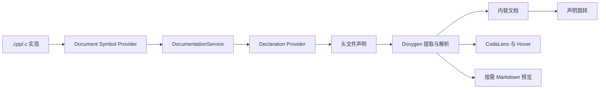

# Architecture

## Overview

C++ HeadDoc 是一个 workspace 扩展。它把 C/C++ 语言服务返回的实现符号和声明位置连接起来，再从头文件声明上方读取 Doxygen，生成可折叠内联文档、CodeLens、Hover 和按需 Markdown 预览。

## 运行时组件

- `activate` 创建 Logger、DocumentationService、内联文档控制器、CodeLens provider、Hover provider、虚拟文档 provider 和 RefreshService，并注册 VS Code API。
- `DocumentationService` 调用 `vscode.executeDocumentSymbolProvider` 发现实现，调用 `vscode.executeDeclarationProvider` 获取声明候选，按工作区、头文件扩展名和路径排序后解析文档。
- `doxygen` 负责清理块注释/行注释、识别标签、整理段落和参数方向，并生成 `ParsedDocumentation`。
- `formatting` 将结构化文档渲染为紧凑内联 HTML、摘要或安全 Markdown。参数使用稳定的彩色标记，摘要按 Unicode grapheme 截断。
- `InlineDocumentationController` 为可见实现创建只读 CommentThread，初始保持收起，展开后由 VS Code 原生布局完成自动换行。
- `HeaderDocCodeLensProvider` 先返回实现位置的待解析 CodeLens，再异步解析文档并附加展开/折叠命令。
- `HeaderDocHoverProvider` 在实现符号选择范围内解析文档，并返回不受信任的 `MarkdownString`。
- `DocumentationContentProvider` 使用 `cpp-head-doc` URI 提供按需打开的只读 Markdown，并在需要时重新解析目标以反映头文件变化。
- `RefreshService` 监听编辑、保存、创建、删除、重命名和配置变化，清理缓存并刷新 CodeLens 与虚拟文档。

## 解析与缓存

1. 源文件扩展名和工作区配置通过 `config` 统一判断。
2. 文档符号被归一化为函数、方法、构造函数和运算符实现；函数体检测用于区分声明与定义。
3. 声明候选只保留配置中的头文件扩展名，并优先选择工作区内的头文件。
4. 头文件声明上方按 `maxCommentSearchLines` 查找相邻 Doxygen 注释。
5. 符号结果和解析结果分别使用 LRU 内存缓存；并发解析由 Semaphore 限制，同一目标的并发请求共享进行中的 Promise。
6. 头文件编辑或配置变化会使缓存失效。缓存和虚拟文档内容在扩展主机内存中维护。

## 安全边界

Hover 与预览关闭 HTML 和信任状态。内联文档仅启用扩展生成的结构标签，所有 Doxygen 内容先完成 HTML 转义；虚拟文档不写入工作区。扩展通过 VS Code 语言服务读取工作区中的源文件、头文件和编译配置，解析结果用于当前编辑会话的显示与跳转。

## 扩展点

VS Code 贡献点包括 C/C++ 语言激活事件、命令、CodeLens、CommentThread 工具栏、编辑器标题菜单，以及 `cppHeadDoc.*` 配置项。扩展类型为 `workspace`，因此 Remote、WSL 和 Container 场景中的语言服务与文件路径应位于同一远程环境。
